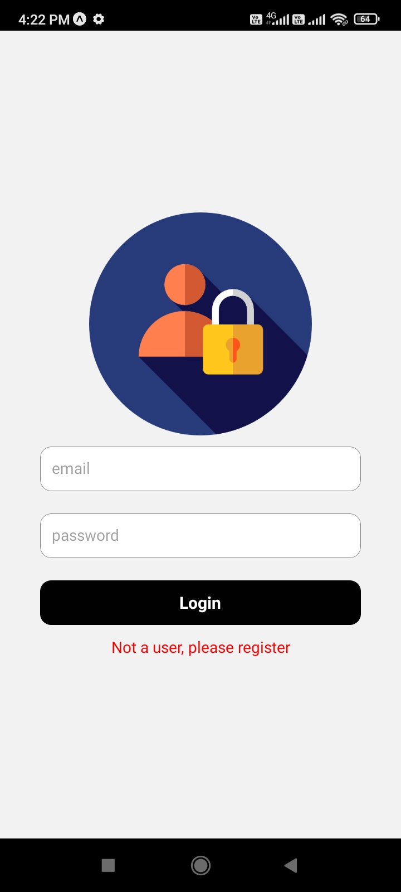
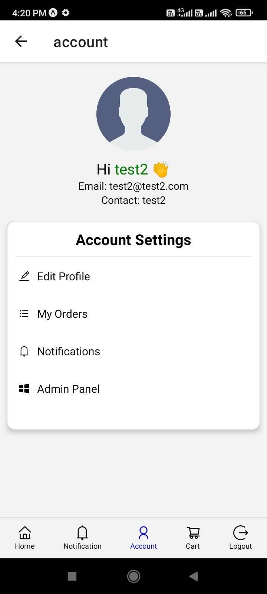

## Android Package(apk)

<a href="https://drive.google.com/file/d/1yJI_FAwwITYEv_kCLfB2mXMsIXMTRQ_H/view?usp=sharing">Ecommerce app Android Build Package(apk)</a>

Creds: Email: test2@test2.com Password: 1234567

## Backend deployed

https://production-nodejs-ecommerce.onrender.com/api/v1

Example: https://production-nodejs-ecommerce.onrender.com/api/v1/product/all-get

## Screenshots

    
    
    
    
    
    
    
    
    
    
    
    
    

